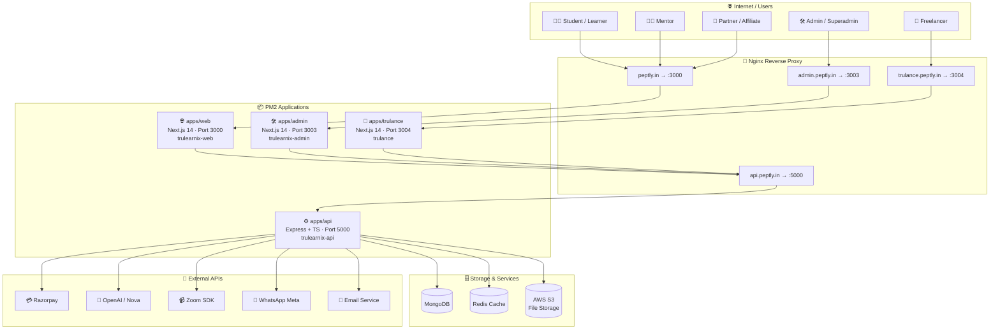
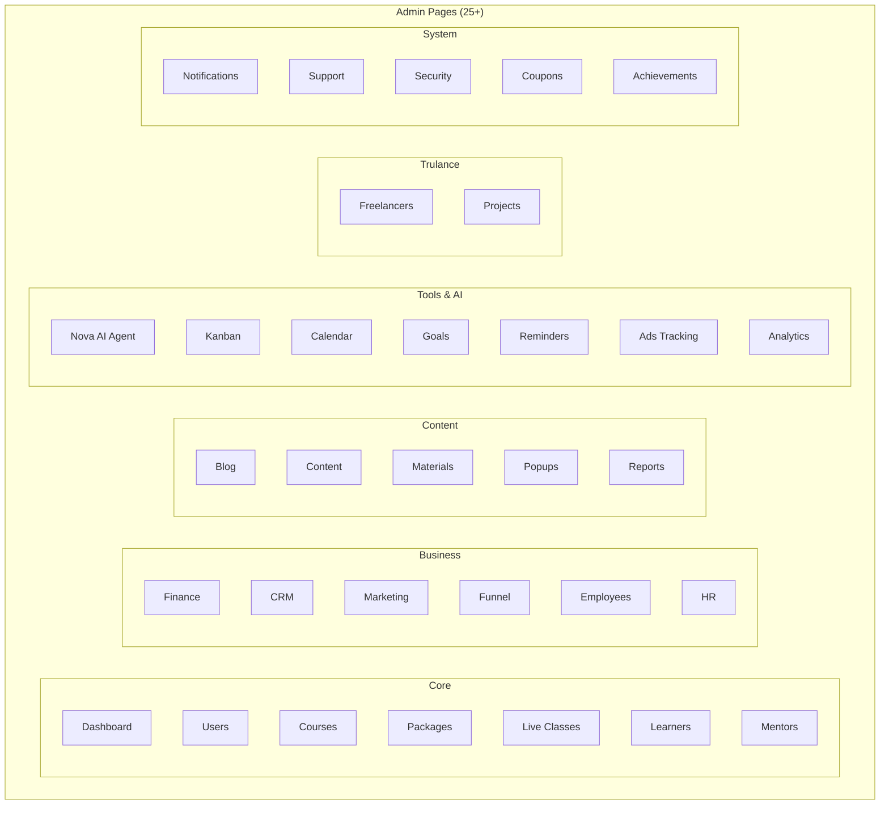
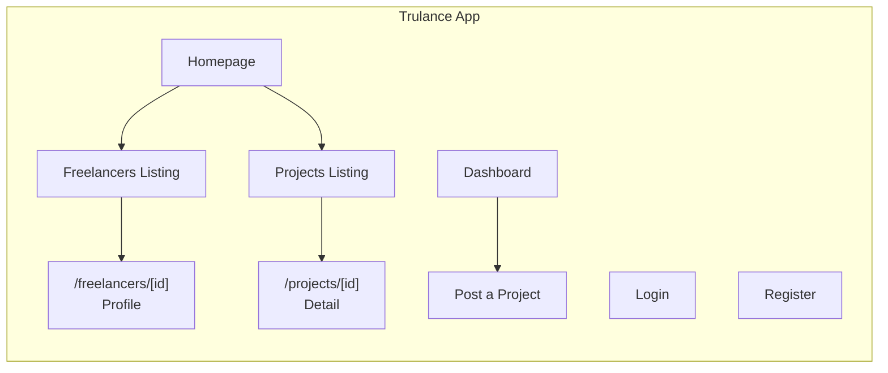
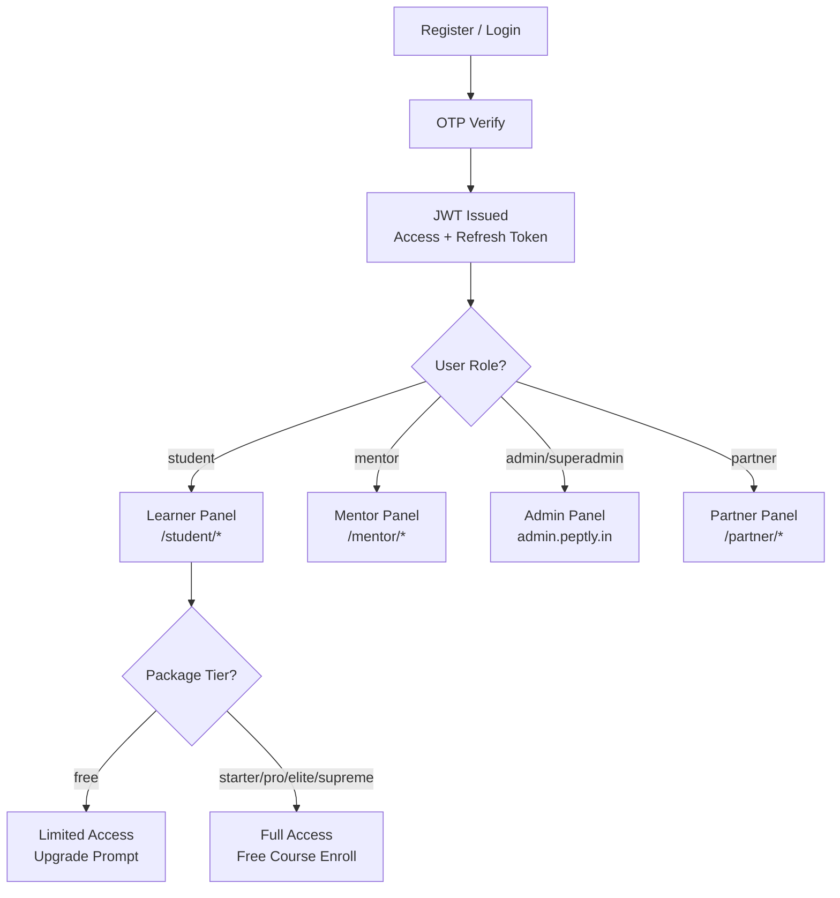
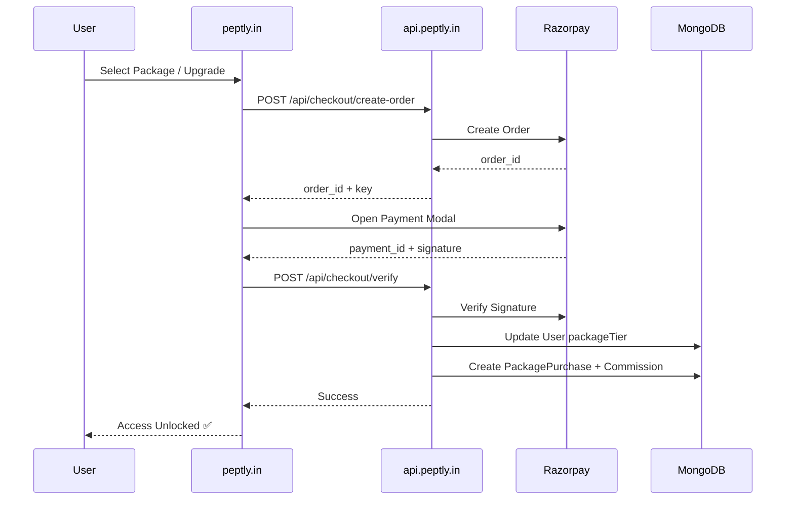

# TruLearnix — Platform Architecture

> Ed-tech + Freelance + Affiliate platform running at **peptly.in**

---

## 🗺️ High-Level System Overview



---

## 🌐 Web App — peptly.in (`apps/web`)

```mermaid
graph LR
    subgraph Public["🔓 Public Pages"]
        PH[/ Homepage]
        PC[/courses]
        PCS["/courses/[slug]"]
        PL[/live-classes]
        PP[/packages]
        PPT["/packages/[tier]"]
        PCO[/checkout]
        PLB[/leaderboard]
        PBM[/become-mentor]
    end

    subgraph Auth["🔐 Auth"]
        AL[/login]
        AR[/register]
        AF[/forgot-password]
        ARP[/reset-password]
        AV["/verify/[id]"]
    end

    subgraph Learner["🎓 Learner Panel /student/*"]
        SD[Dashboard\nFocus Timer + Stats]
        SC[My Courses\nEnrolled + Available]
        SCL["/courses/[id]"]
        SCL2["/classes/[id]"]
        SA[Announcements]
        SF[Favorites]
        SU[Upgrade / Plans]
        SQ[Quizzes]
        SQD["/quizzes/[id]"]
        SCERT[Certificates]
        SASS[Assignments]
        SCOM[Community]
        SWLT[Wallet]
        SAIC[AI Coach]
        SAFF[Affiliate]
        SJB[Jobs]
        SPJ[Projects]
        SBR[Brand]
        SFL[Freelance]
        SPROF[Profile]
    end

    subgraph Partner["🤝 Partner Panel /partner/*"]
        PD[Dashboard]
        PE[Earnings]
        PLB2[Leaderboard]
        PCRM[CRM]
        PK[KYC]
        PT[Training]
        PLG[Link Generator]
        PR[Referrals]
        PM[M-Type]
        PQ[Qualification]
        PAC[Achievements\nCanvas Poster]
    end

    subgraph Mentor["👨‍🏫 Mentor Panel /mentor/*"]
        MD[Dashboard]
        MCO[Courses]
        MCL[Classes]
        MS[Students]
        ME[Earnings]
        MQ[Quizzes]
        MPROF[Profile]
    end

    subgraph Components["🧩 Shared Components"]
        LS[LearnerSidebar\nDesktop + Mobile + BottomNav]
        PS[PartnerSidebar\nViolet Theme]
        NS[Navbar]
        FT[Footer]
        POP[PopupManager\nAnnouncementPopup\nEarningsToast\nEventPopup\nPresentationPopup]
        HERO[HeroSection]
        STATS[StatsSection]
        FEAT[FeaturedCourses]
        LIVE[LiveClassesSection]
        EARN[EarningsProofSection]
        TEST[TestimonialsSection]
        PRICE[PricingSection]
        WOL[WallOfLove]
        ACH[AchievementsSection]
        HIW[HowItWorks]
        WHY[WhyLiveSection]
        CTA[CTASection]
    end
```

---

## 🛠️ Admin Panel — admin.peptly.in (`apps/admin`)



---

## ⚙️ API Server — api.peptly.in (`apps/api`)

```mermaid
graph LR
    subgraph Routes["📡 API Routes (35+)"]
        direction TB
        R1[/api/auth]
        R2[/api/users]
        R3[/api/courses]
        R4[/api/classes]
        R5[/api/packages]
        R6[/api/checkout]
        R7[/api/partner]
        R8[/api/affiliate]
        R9[/api/admin]
        R10[/api/mentor]
        R11[/api/nova]
        R12[/api/marketing]
        R13[/api/finance]
        R14[/api/crm]
        R15[/api/blog]
        R16[/api/quizzes]
        R17[/api/certificates]
        R18[/api/assignments]
        R19[/api/community]
        R20[/api/wallet]
        R21[/api/payments]
        R22[/api/notifications]
        R23[/api/trulance]
        R24[/api/freelance]
        R25[/api/projects]
        R26[/api/popups]
        R27[/api/upload]
        R28[/api/analytics]
        R29[/api/goals]
        R30[/api/reminders]
    end

    subgraph Models["🗃️ MongoDB Models (35+)"]
        direction TB
        M1[User]
        M2[Course]
        M3[Enrollment]
        M4[Package + PackagePurchase]
        M5[Payment + Transaction]
        M6[LiveClass]
        M7[Quiz]
        M8[Certificate]
        M9[Assignment]
        M10[Commission + Withdrawal]
        M11[Notification]
        M12[SupportTicket]
        M13[CommunityPost]
        M14[Blog]
        M15[FreelanceJob]
        M16[Lead]
        M17[Campaign]
        M18[ChatbotFlow]
        M19[Expense + EmiInstallment]
        M20[NovaConfig]
        M21[Popup + SiteContent]
        M22[WhatsAppChat]
        M23[MediaFile + StudyMaterial]
        M24[Goal + Task + Reminder]
        M25[EmployeeReport + MarketingTemplate]
    end

    subgraph Services["🔧 Services"]
        S1[novaAgentService\nOpenAI / AI Coach]
        S2[whatsappMetaService\nMeta Cloud API]
        S3[zoomSdkService + zoomService\nLive Classes]
        S4[s3Service\nFile Uploads]
        S5[emailService\nOTP + Notifications]
        S6[certificateService\nAuto Certificate Gen]
        S7[socketService\nReal-time Events]
    end

    subgraph Middleware["🛡️ Middleware"]
        MW1[authMiddleware\nJWT Verify]
        MW2[affiliateGuard\nPartner Auth]
        MW3[adminGuard\nAdmin Only]
        MW4[mentorGuard\nMentor Only]
    end
```

---

## 💼 Trulance — Freelance Marketplace (`apps/trulance`)



---

## 🔐 Auth & User Role Flow



---

## 💳 Payment & Package Flow



---

## 🤖 Nova AI Agent Flow

```mermaid
flowchart LR
    USER[Student] -->|Ask Question| NOVA[/api/nova]
    NOVA --> NCONFIG[NovaConfig\nSystem Prompt + Context]
    NCONFIG --> OPENAI[OpenAI GPT]
    OPENAI --> RESP[AI Response]
    RESP --> CHAT[WhatsApp Meta API\nor Web Chat]
    CHAT --> USER
```

---

## 📁 Monorepo Directory Structure

```
trulearnix/
├── apps/
│   ├── web/                    # peptly.in — Next.js 14 (Port 3000)
│   │   ├── app/
│   │   │   ├── (auth)/         # login, register, forgot-password
│   │   │   ├── (public)/       # homepage, courses, packages, checkout
│   │   │   ├── (student)/      # /student/* — Learner Panel (20 pages)
│   │   │   ├── (mentor)/       # /mentor/* — Mentor Panel (7 pages)
│   │   │   ├── (partner)/      # /partner/* — Partner Panel (11 pages)
│   │   │   └── become-mentor/
│   │   ├── components/
│   │   │   ├── layout/         # Navbar, Footer, LearnerSidebar, PartnerSidebar
│   │   │   ├── popups/         # PopupManager, AnnouncementPopup, EarningsToast
│   │   │   ├── shared/         # HeroSection, Stats, Testimonials, Pricing...
│   │   │   └── ui/             # Logo, Tilt3D, buttons...
│   │   └── lib/                # api.ts, store.ts (Zustand), affiliateData.ts
│   │
│   ├── admin/                  # admin.peptly.in — Next.js 14 (Port 3003)
│   │   ├── app/                # 25+ admin pages
│   │   └── components/         # AdminLayout, Sidebar
│   │
│   ├── api/                    # api.peptly.in — Express + TypeScript (Port 5000)
│   │   └── src/
│   │       ├── models/         # 35+ MongoDB models
│   │       ├── routes/         # 35+ API route files
│   │       ├── controllers/    # Business logic
│   │       ├── services/       # Nova, WhatsApp, Zoom, S3, Email, Socket
│   │       └── middleware/     # auth, affiliateGuard, adminGuard
│   │
│   └── trulance/               # Freelance Marketplace — Next.js 14 (Port 3004)
│       ├── app/                # 8 pages
│       └── components/         # Navbar
│
├── nginx/                      # Nginx config files
├── ecosystem.config.js         # PM2 process manager config
└── package.json                # Monorepo root
```

---

## 🧰 Tech Stack Summary

| Layer | Technology |
|-------|-----------|
| Frontend | Next.js 14, TypeScript, TailwindCSS |
| State Management | Zustand, React Query 5 |
| Backend | Express.js, TypeScript |
| Database | MongoDB (local) |
| Cache | Redis (local) |
| File Storage | AWS S3 |
| Auth | JWT (Access + Refresh Token), HTTP-only Cookies |
| Payments | Razorpay |
| AI | OpenAI (Nova Agent) |
| Live Classes | Zoom SDK + WebRTC |
| Messaging | WhatsApp Meta Cloud API |
| Real-time | Socket.io |
| Process Manager | PM2 |
| Reverse Proxy | Nginx |
| Deployment | VPS (Hostinger) |
